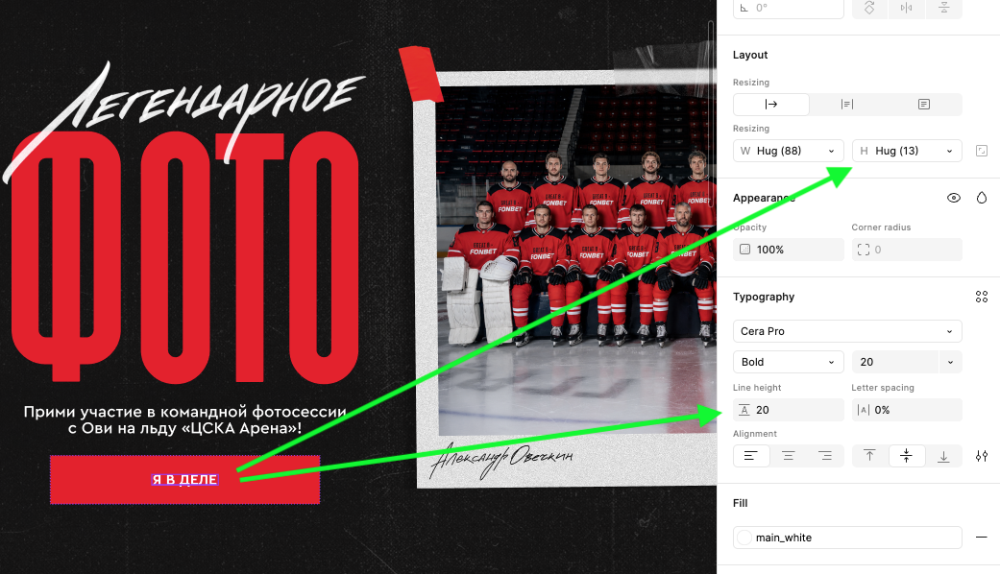
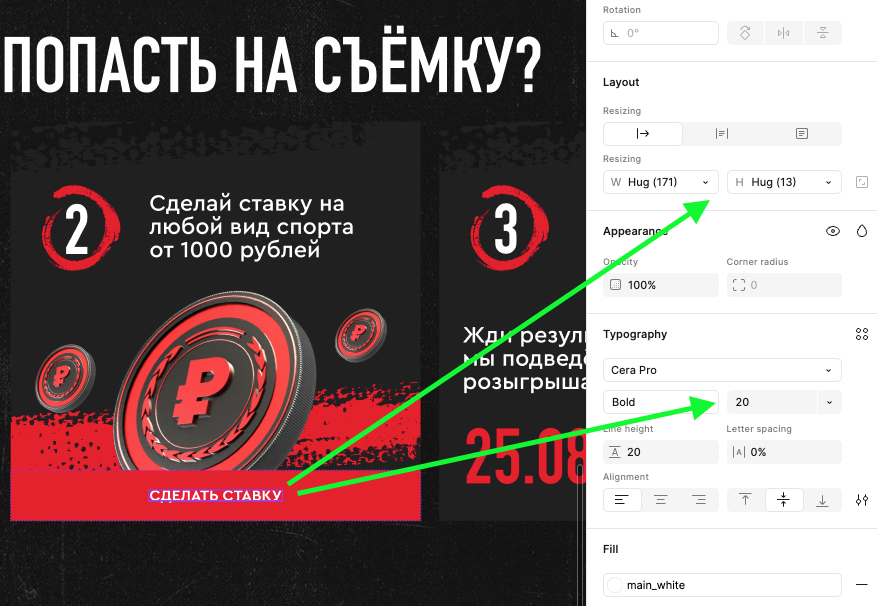
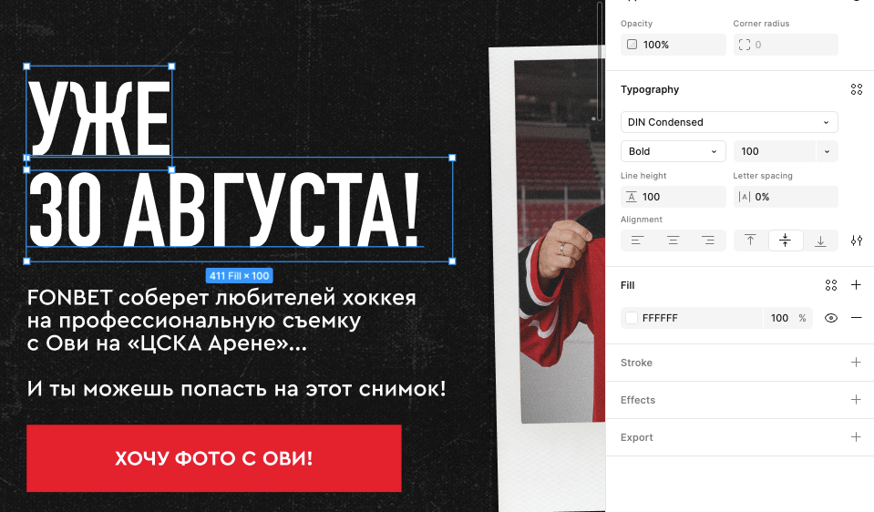
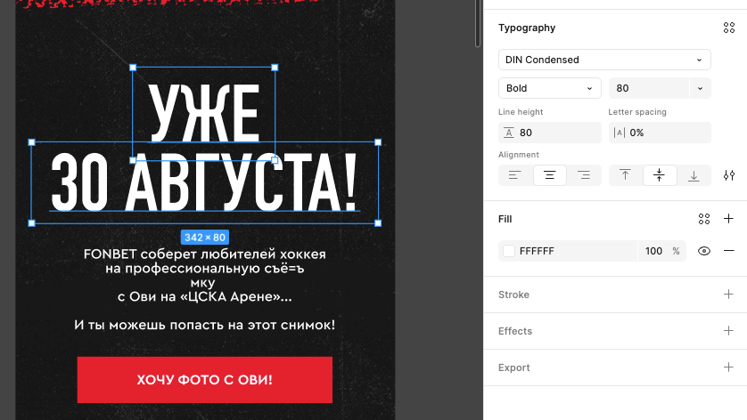
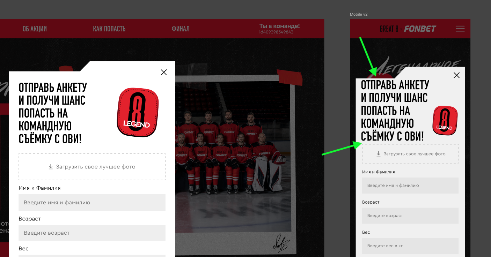
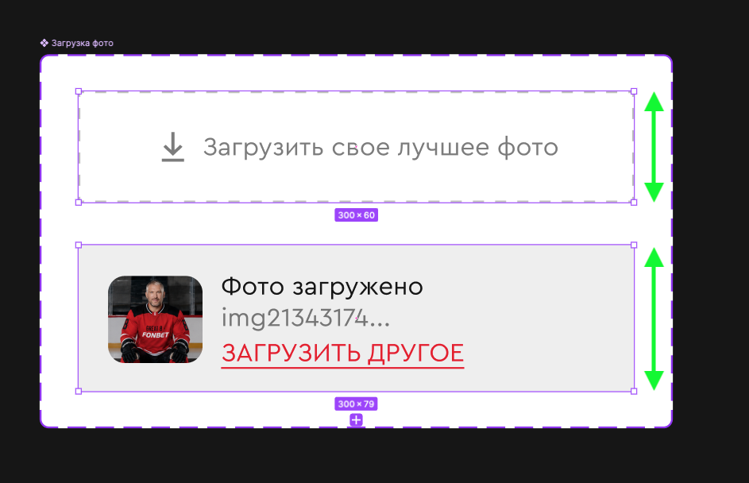
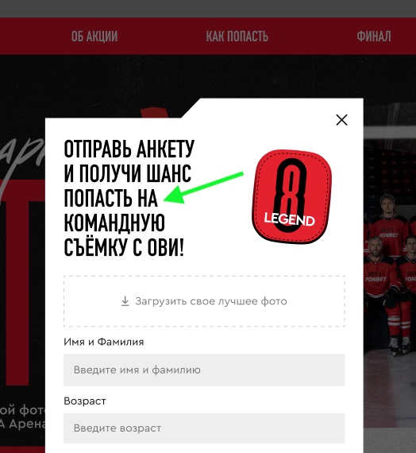
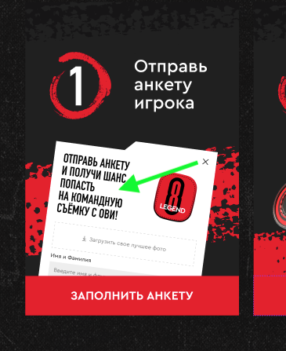

# Лендинг «Легендарное фото» (27.07.2026)

- [Текстовые элементы](#typography)
- [Сетка](#questionnaire)
- [Другое](#other)

## Текстовые элементы

- Размер высоты строки в клавишах меньше текстового блока

  
  

- Сделать заголовок одним тестовым блоком

  
  

## Анкета

- В мобильной версии отсутствуют отступы сверху внутри анкеты и между заголовком и формой

  

- Высота поля для загрузки фото должна быть одинаковой если файл загружен и если нет

  

- Модалка анкеты будет со вертикальным скроллом (мобайл+десктоп)
- Так как крестик в модалке анкеты как бы находится на корешке бланка, он должен скроллиться вместе с ним и будет уходить за край экрана. Как вариант можно скроллить лишь контект анкеты.
- Свисающий предлог в заголовке модальки и нормальный в карточке секции "Как попасть на съёмку". Как сделать?

  
  

## Другое

- Не нашел макет "профиля" для клавиши "скачать профиль"
- Убрать регламент из футера мобайла (если он не нужен)

