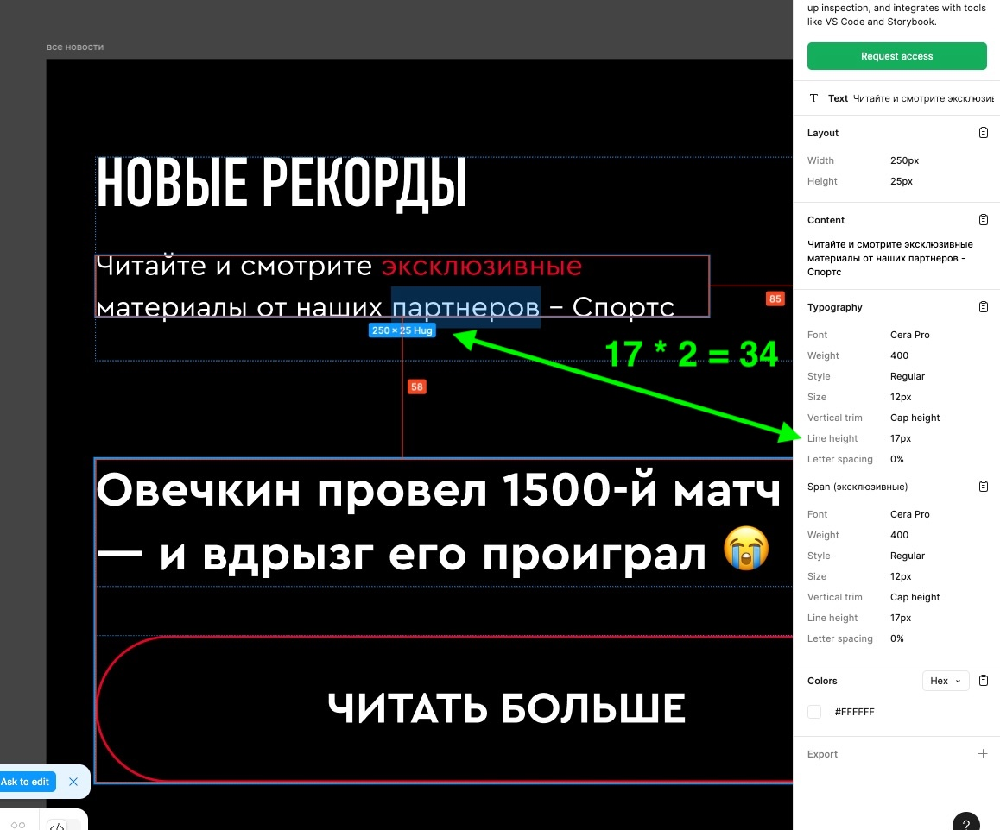
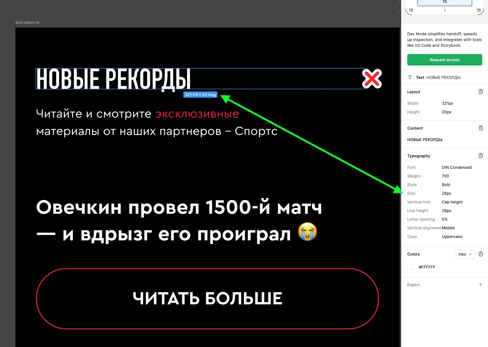

# Блок «Новости» (upd 13.11.25)

- [Мобайл](#mobile)
  - [Размеры текстовых блоков](#mobile-text)
  - [Фунционал](#mobile-logic)

## Десктоп

Все ок!

## МОБАЙЛ

### Размеры текстовых блоков

1. Размеры блоков в заголовке на самом правом фрейме не соответствуют размеру высоты текста

    
    

