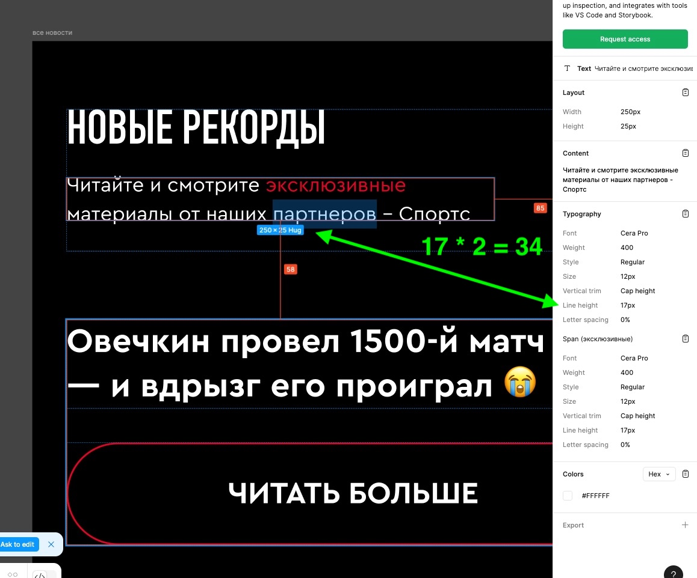
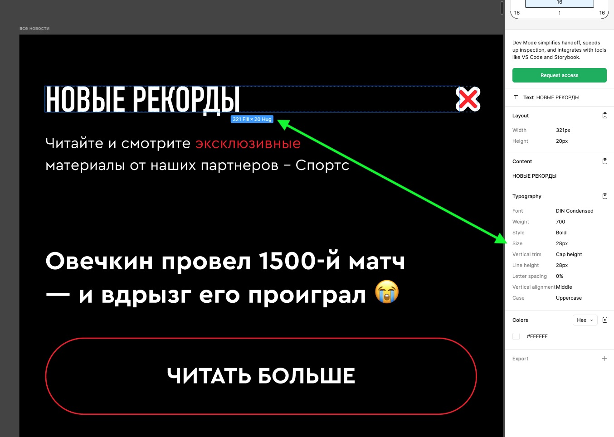

# Блок «Новости» (upd 13.11.2025)

- [Десктоп](#desktop)
- [Мобайл](#mobile)
  - [Размеры текстовых блоков](#mobile-text)

## Десктоп

Все ок!

## Мобайл

### Размеры текстовых блоков

1. Размеры блоков в заголовке на самом правом фрейме не соответствуют размеру высоты текста

    
    

