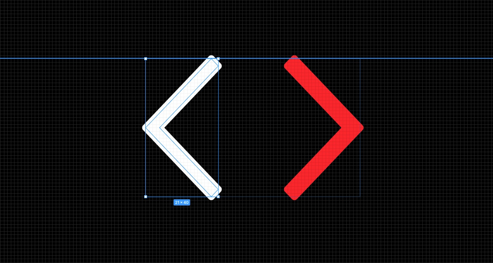
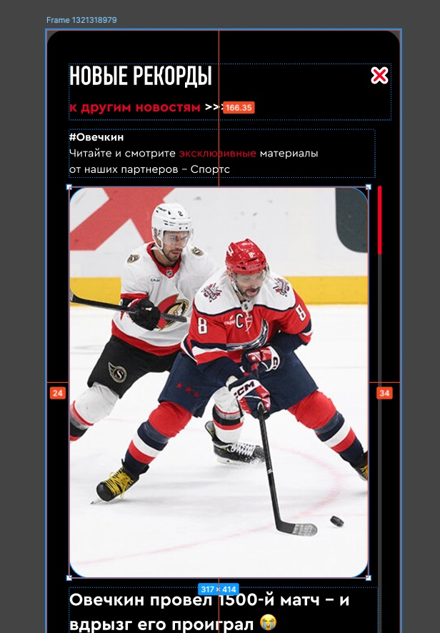

# Блок «Новости» (upd 29.10.25)

- [Десктоп](#desktop)
  - [Размеры текстовых блоков на странице](#desktop-text)
  - [Размеры текстовых блоков в модальном окне](#desktop-mobile-text)
  - [Размеры блоков в модальном окне](#desktop-mobile-block)
  - [Размеры иконок](#desktop-icon)
- [Мобайл](#mobile)
  - [Сетка](#mobile-layout)
  - [Размеры текстовых блоков](#mobile-text)
  - [Фунционал](#mobile-logic)

## Десктоп

### Размеры текстовых блоков на странице

Прошу поправить размеры текстовых блоков, чтобы они соответствовали формуле __кол-во строк * размер высоты строки__. 

- заголовок
- текст возле заголовка
- текст в карточке

Вот хороший пример, почему это важно. Отступ от текста указан 40рх, а размер текста больше (4*30=120рх), чем размер текстового блока (105рх). Это значит что отступ в макете не 40, а 25рх.

### Размеры текстовых блоков в модальном окне

Можно увидеть, что из-за неправильных размеров текста отступы в 50, 20, 30 не верны. Реальные отступы не кратны цифре десять.

### Размеры блоков в модальном окне

Модальное окно имеет отступы 48рх по горизонтали и 50рх по вертикали. Но из за того, что клавиша помещена в контейнер который больше её, реальный отступ вместо 50рх стал 58рх

### Размеры иконок

У иконок контейнер меньше, чем размер иконки. Добавлен stroke для увеличиения иконки, который выходит за размеры иконки.

## МОБАЙЛ

### Сетка

1. Размер изображения в списке имеет справа больше отступ чем контейнер, так надо или ошибка?

    

2. Фото у открытой новости имеет разные размеры/отступы на разных фреймах

    
    
    

3. Контейнер у открытой новости имеет разные размеры/отступы на разных фреймах.

    
    

### Размеры текстовых блоков

Размеры блока заголовка не соответствуют размеру высоты текста

### Фунционал

1. ~~Нужно отрисовать пагинацию когда слайдов больше 7~~ Если новостей будет меньше 10-12 то уменьшаем размер булета 

2. В горизонтальном слайдере все карточки должны быть одинаковой высоты. Размер текста фиксируем в две строки?

    

3. Не понятно куда ведет ссылка "другие новости". Туда же куда логотип "Спортс"?
