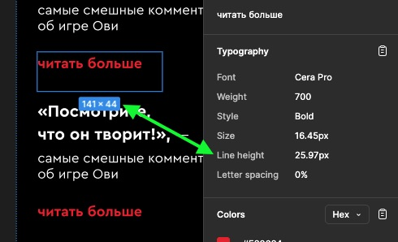

# Блок «Новости»

1. Размер блоков текстовых элементы или групп текстовых элементов не соответвует параметрам текста.

    
    
    
    
    
    
    
    
    
    
    
    
    
    
    
    
    
    

2. Элементы блока не находятся в сетке, имеют разные отступы. Некоторые карточки новостей сделаны просто добавлением текста (без добавления самой карточки).

    
    
    
    
    

3. Одни и теже элементы имеют разные размеры, отступы, цвета, оформление в одинаковых макетах.

    
    
    
    
    

4. Присутствуют интерактивные элементы, смысл которых непонятен.

    
    

5. Фон у блока в мобильной версии есть, в десктопной нет.

    

6. Декоративные элементы находиться за блоком на одном фрейме и перед внутри блока в другом фрейме

    

7. Не хватает неактивной пагинации у слайдера.

    

8. Не понятно как на десктопе открываются новости:

    

    - Указано открывать как игры, а нарисовано модальное окно. Игры расположены в "потоке" лендинга, а модалка находится вне потока, на отдельном слое спереди.
    - Если это модалка, то зачем пролистывать вниз.
    - Если это модалка, то не хватает оверлея (затемнённого слоя за модальным окном на весь экран, чтобы он не сливался с лендингом).
    - Если это модалка, не понятны отступы от краев экрана браузера, размеры модального окна.
    - Скролбар находится не по высоте блока, который скролится. Это может сбивать столку, а так же скролл может скрывать за краем экрана, если модальное окно высокое
        

9. Не понятно как на мобилке открываются новости:

    - Фото новостей в списке должно отображатся у каждой нечетной?
    - У одних фреймов есть хештег, а у других нет
        
    - У двух фреймов с закрытыми новостями разные отступы, параметры шрифтов, скругления фото, наличия подчеркивания клавиши "читать больше"
        
    - Что происходит при нажатии "больше статей":
        - Отображаются все новости (сайт может сильно "удлиниться" если доступных новостей больше 15-20 штук).
        - Показывать дополнительно 2-5 новости, при повторном нажатии добавлять еще столько же.
    - Открытие новости отличаеться от десктопа:
        - Новость разворачиваеться вниз, а не открывает модальное окно. Сайт может сильно удлиниться если много контента в новости, навигация по странице может быть усложнена.
        - Если при открытии одной новости, потом открывать другую, то нужно ли сворачивать первую? Если нет, то сайт может сильно удлиниться.

10. Блок на мобильной и десктопной версии — это две разные сущности: горизонтальный слайдер с модальным окном и список "показать еще" с открытой новостью в потоке этого списка. Они действительно так сильно должны различатся на разных версиях?

11. Непонятно зачем нужен хештег #Овечкин:
    - Если нет других хештегов.
    - Он иногда находиться в открытой новости, иногда в списке новостей.

12. Непонятно куда ведет ссылка "другие новости" и почему на десктопе её нет.
